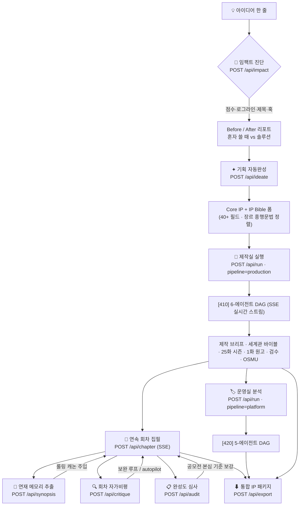
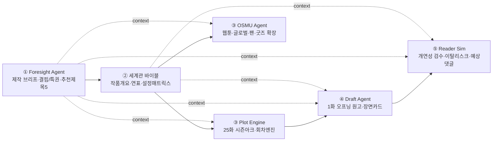
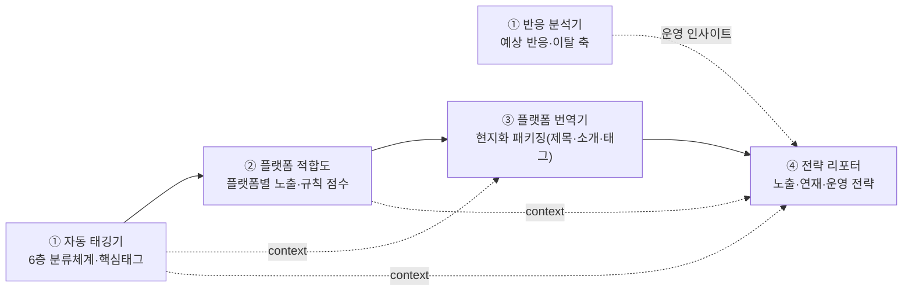
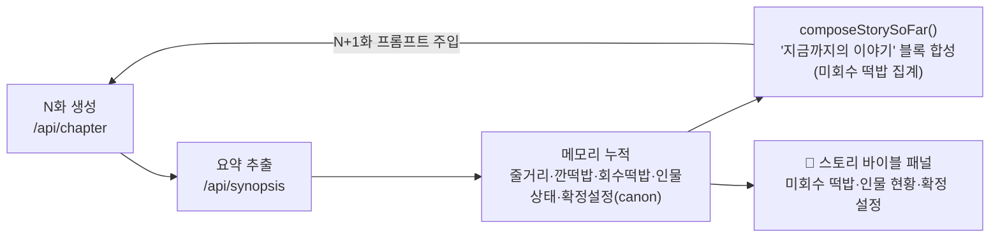
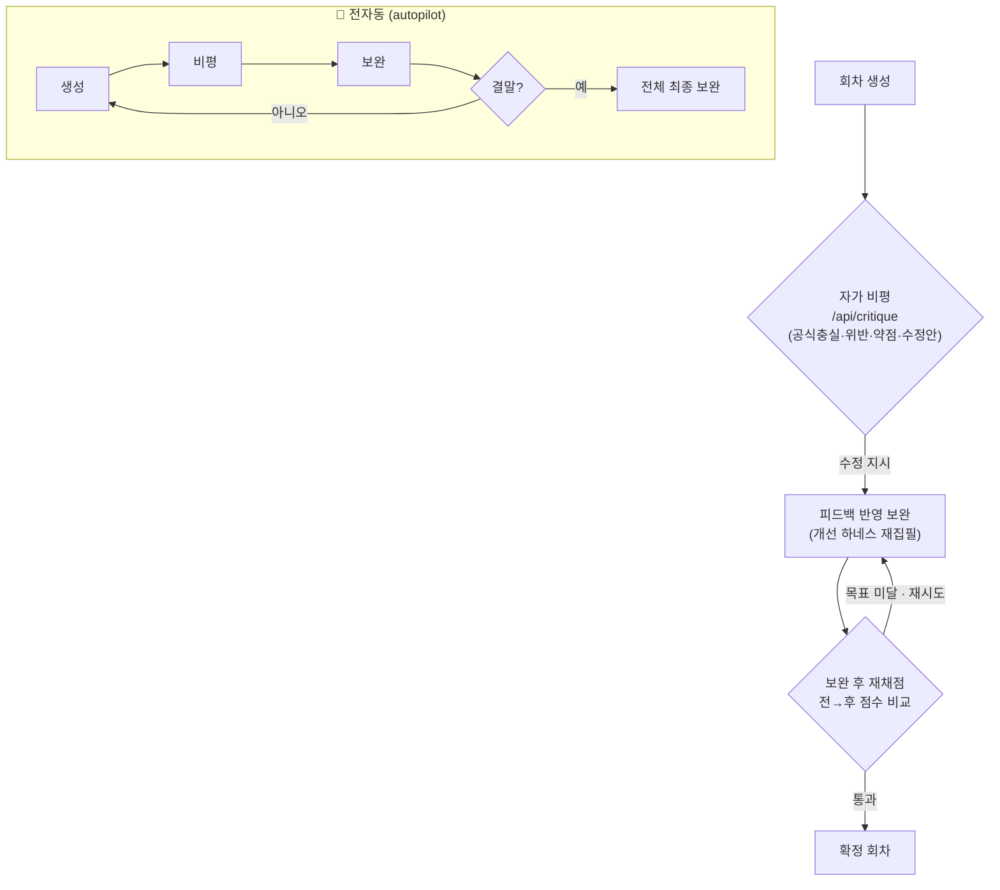
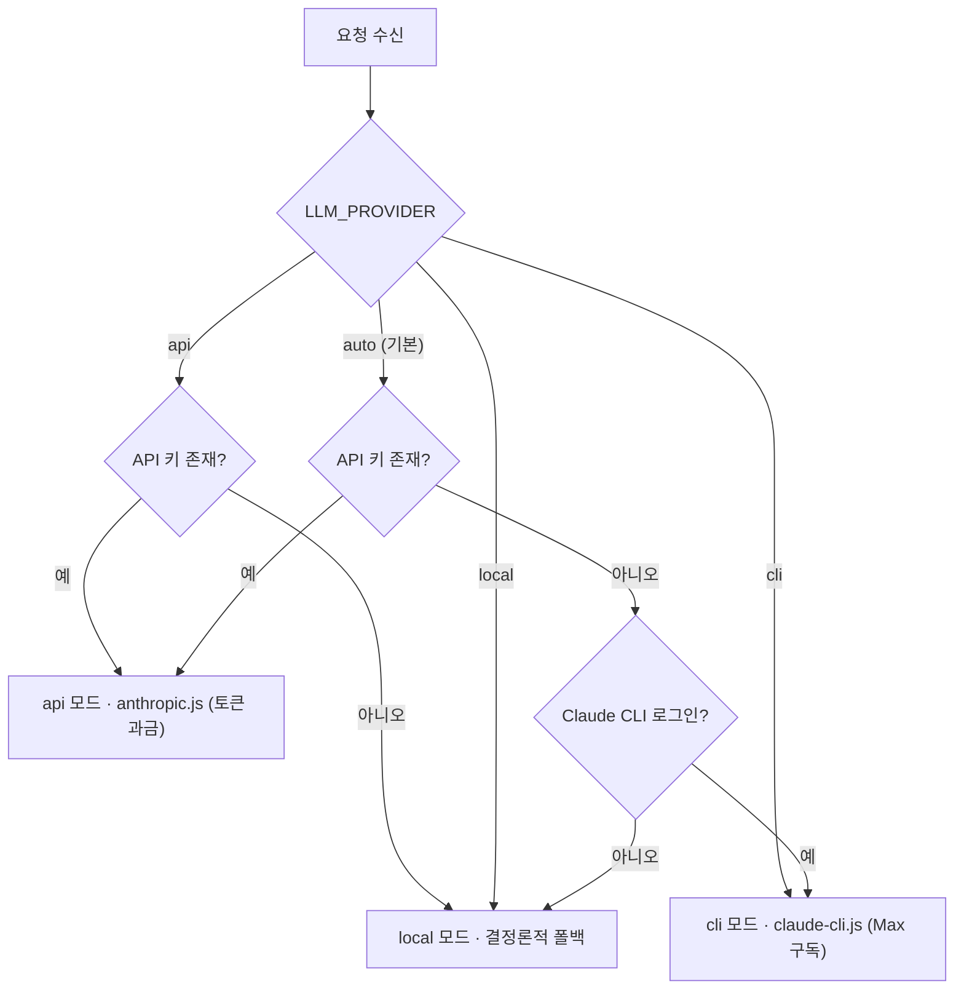

# 🚀 SF WebNovel Future Agent

> **An AI-future SF webnovel IP production agent** — turns a single future premise into a production-ready webnovel IP through a real Claude-powered, 6-agent orchestration pipeline.

박성우(AI FUTURE STREAMER)의 `AI FORESIGHT` 관점을 바탕으로 만든 **AI 미래 SF 웹소설 제작 AI Agent 툴**입니다.
실제 Claude(Anthropic) API로 동작하는 6-에이전트 오케스트레이션 파이프라인이 작품 기획을 받아 SF Bible, 시즌 설계, 1화 원고, 검수, OSMU까지 **실시간 스트리밍**으로 생성합니다.

> v1은 키 없이 도는 결정론적 시뮬레이터였습니다. v2는 실제 LLM 연동 · 스트리밍 · 프로젝트 저장 · 안전한 키 관리를 갖춘 **상업 운영용 MVP**입니다.

<sub>Node.js 18+ · Zero-dependency backend · Anthropic Claude (Opus / Sonnet / Haiku) · Made by **Park Seong-Woo (박성우)**</sub>

---

## 🗺️ 전체 워크플로우 구조도 (System Workflow Architecture)

> 아이디어 한 줄이 **연재 가능한 웹소설 IP**가 되기까지의 전체 처리 흐름을 도면화했습니다.
> 아래 **FIG. 1**은 시스템 전체 구성도(특허 도면식 도면부호 포함)이며, FIG. 2~7은 각 처리 단계를 세부 도식화한 것입니다.

### FIG. 1 — 전체 시스템 구성도 (Master Architecture)

```text
┌──────────────────────────────────────────────────────────────────────────────┐
│        SF·웹소설 IP 제작·운영 시스템 — 전체 구성 (FIG. 1)                         │
└──────────────────────────────────────────────────────────────────────────────┘

 [100] 사용자  ─ 웹소설 작가 / 플랫폼 PD / IP 기획자
   │   입력: 아이디어 한 줄 · 작품 입력(40+필드) · 원고/리뷰 · 과학근거 PDF
   ▼
╔══════════════════════════ [200] 프론트엔드 (public/) ══════════════════════════╗
║  [210] index.html  제작실·운영실 UI · IP Bible 폼 · Before/After 모달           ║
║  [220] app.js      SSE 스트림 파서 · 상태관리 · 실시간 렌더 · 스토리바이블 패널  ║
║  [230] markdown.js · styles.css                                                 ║
╚════════════════════════════════════╤═══════════════════════════════════════════╝
              REST(JSON 요청)  │  ▲  SSE(text/event-stream, 토큰 실시간 스트림)
                               ▼  │
╔══════════════════════════ [300] HTTP 서버 (server.js) ═════════════════════════╗
║  라우터 · SSE 방출 · 정적 서빙 · 본문 상한 · 경로 traversal 차단                 ║
║   [310] 단발 REST  : /ideate /impact /synopsis /critique /audit /reference      ║
║                      /playbook /platform-meta /config /health                   ║
║   [320] SSE 스트림 : /run(제작·운영 파이프라인) · /chapter(연속 회차 집필)        ║
║   [330] 영속/출력  : /projects(CRUD) · /export(통합 Markdown)                    ║
╚═══════════╤═══════════════════════════════════════════════════╤═════════════════╝
            ▼                                                   ▼
 [400] 오케스트레이터 (orchestrator.js)          [500] 단발 AI 기능 모듈
   · dependsOn 분석 → 실행 웨이브 산출             · impact.js   (Before/After 진단)
   · 같은 웨이브 병렬 / 앞 웨이브 결과 주입         · ideate.js   (아이디어→Core IP)
   · 이벤트 방출(meta·start·delta·done)           · chapters.js (연속 회차 집필)
        │                                          · memory.js   (연재 메모리/캐논)
        │  ┌─────────────────────────────┐         · critique.js (회차 자가비평)
        │  │ [410] 제작실 6-에이전트 DAG  │         · audit.js    (완성도 심사)
        │  │ [420] 운영실 5-에이전트 DAG  │              │
        │  └─────────────────────────────┘              │
        └───────────────────────┬───────────────────────┘
                                ▼
                  [600] LLM 추상화 계층 (llm.js)  ── 단일 streamMessage() 인터페이스
            ┌───────────────────┼────────────────────────┐
            ▼                   ▼                         ▼
   [610] api 모드        [620] cli 모드           [630] local 모드
   anthropic.js          claude-cli.js            local-engine.js · platform-local.js
   (Messages API,        (Claude Code/Max         (LLM 없는 결정론적 폴백,
    토큰 과금)            구독, 무 과금)            전 장르/운영실 데모 보장)
            │                   │
            └─────────┬─────────┘
                      ▼
        [700] 지식베이스 (구조화 데이터 · 무 LLM)
          · playbook.js      23개 장르 흥행 문법(공식·5화·루프·제목·실패패턴)
          · platform-intel.js 6층 태깅 분류 · 플랫폼 규칙 · 페르소나 · 성공/실패식
                      │  (모든 에이전트 프롬프트에 자동 주입)
                      ▼
        [800] 저장소  store.js  →  data/projects/*.json (파일 기반, 단일 테넌트)

  ── 도면부호 ──────────────────────────────────────────────────────────────────
   100 사용자        200 프론트엔드     300 HTTP/REST·SSE 서버   400 오케스트레이터
   410 제작 DAG      420 운영 DAG       500 단발 AI 모듈         600 LLM 추상화
   610 API엔진       620 CLI엔진        630 로컬폴백             700 지식베이스
   800 영속 저장소
```

### FIG. 2 — 엔드투엔드 사용자 워크플로우 (Idea → IP)



### FIG. 3 — 제작실 파이프라인 DAG ([410] Narrative Intelligence)

> 오케스트레이터가 `dependsOn`을 위상 정렬해 **웨이브**로 실행한다. 실선=주 진행, 점선=상위 산출물 컨텍스트 주입. ③의 Plot·OSMU는 **동일 웨이브 병렬**.



### FIG. 4 — 운영실 파이프라인 DAG ([420] Platform Intelligence)

> ①의 태깅기·반응 분석기는 병렬. 같은 작품을 플랫폼별(HFY·Royal Road·Webnovel·네이버·카카오) 규칙으로 태깅·번역·운영한다.



### FIG. 5 — 연재 메모리 루프 (Rolling Canon · 장거리 연속성)

> N화를 쓸 때 "직전 1개 화"만 보던 한계를 해결. 회차마다 구조화 요약을 누적해 **다음 회차 프롬프트에 '지금까지의 이야기'로 주입** → 떡밥 회수·설정 일관성 보장.



### FIG. 6 — 자가비평·보완 하네스 (Self-Critique & Autopilot)



### FIG. 7 — 엔진 결정 로직 (Provider Resolution · api / cli / local)



> **모든 경로는 동일한 `streamMessage()` 인터페이스로 수렴**하므로, 엔진이 바뀌어도 오케스트레이터·AI 모듈은 코드를 바꾸지 않는다. 키가 없어도 `local`이 전 장르·운영실 데모를 끊김 없이 보장한다.

---

## 빠른 시작

```bash
# 1. 키 설정
cp .env.example .env
#   .env 파일을 열어 ANTHROPIC_API_KEY=sk-ant-... 입력

# 2. 실행 (별도 의존성 설치 불필요 — Node 18+ 내장 fetch 사용)
npm run dev
```

브라우저에서 엽니다.

```text
http://127.0.0.1:4173
```

키가 없어도 **로컬 폴백 모드**로 즉시 데모가 동작합니다(결정론적 미리보기). 키를 넣으면 자동으로 Claude 실시간 생성으로 전환됩니다.

## 엔진 3가지 (API 없이 Max 구독으로도 가능)

`LLM_PROVIDER` 환경변수로 두뇌를 고릅니다.

| 모드 | 설명 | 비용 |
|---|---|---|
| `api` | Anthropic API 직접 호출 | 토큰 과금 (콘솔 크레딧) |
| `cli` | **로컬 Claude Code (Pro/Max 구독 인증)** | 구독 한도 내 |
| `local` | LLM 없이 결정론적 미리보기 | 무료 |
| `auto` (기본) | 키 있으면 api → 없고 CLI 로그인됐으면 cli → 둘 다 없으면 local | — |

### Claude Max 구독으로 돌리기 (API 크레딧 소진 시)

API 크레딧을 다 썼지만 **Claude Max** 구독이 있다면, 토큰 과금 없이 구독으로 생성할 수 있습니다.

```bash
# 1) Claude Code CLI 설치 (한 번만)
npm install -g @anthropic-ai/claude-code

# 2) Max 계정으로 로그인 (브라우저 OAuth)
claude            # 실행 후 로그인, 또는 세션에서  /login

# 3) .env 에 엔진을 구독으로 고정
#    LLM_PROVIDER=cli
#    (선택) claude 가 PATH에 없으면  CLAUDE_BIN=...\npm\claude.cmd

# 4) 서버 재시작
npm run dev
```

작동 원리: 백엔드가 각 에이전트마다 `claude -p --output-format stream-json --include-partial-messages`를 호출하고 스트림을 그대로 화면에 흘립니다.

> ⚠️ **API 키 함정**: `ANTHROPIC_API_KEY`가 환경에 남아 있으면 Claude Code가 그걸 우선해 **다시 토큰 과금**합니다. 그래서 `cli` 모드는 자식 프로세스 환경에서 키를 자동 제거해 **무조건 구독**으로 돕니다. (단 `auto`는 키가 있으면 api를 먼저 고르니, 구독을 원하면 `cli`로 고정하세요.)
>
> ⚠️ **상업/멀티유저 주의**: 개인 Max 구독으로 **다른 사용자에게 서비스**하는 건 Anthropic ToS 위반입니다. 본인 집필·개발·데모용은 OK. 외부 판매/다중 사용자는 `api` 키 과금이나 Team/Enterprise를 쓰세요.

## 아키텍처

```
public/            프론트엔드 (정적)
  index.html       제작실/운영실 UI · IP Bible 폼 · Before/After 모달
  app.js           SSE 스트리밍 파싱 · 프로젝트 관리 · 실시간 렌더 · 스토리바이블
  markdown.js      경량 Markdown 렌더러
  styles.css
lib/               백엔드 모듈
  config.js        .env 로더 · 모델/포트 설정 · 엔진(api/cli/local) 결정 (의존성 0)
  llm.js           LLM 추상화 — 단일 streamMessage() 인터페이스
  anthropic.js     Claude Messages API 스트리밍 클라이언트 (fetch 기반, api 모드)
  claude-cli.js    Claude Code CLI 스트리밍 클라이언트 (Max 구독, cli 모드)
  agents.js        제작실 6-에이전트 정의 + 시스템 프롬프트 + 의존성 그래프
  platform-intel.js 운영실 5-에이전트 + 플랫폼 규칙·6층 분류·페르소나·성공/실패식
  orchestrator.js  의존성 기반 파이프라인 실행 (순차·병렬) + 이벤트 방출
  playbook.js      23개 장르 흥행 문법 · 프리셋 · 세부장르 (구조화 데이터)
  ideate.js        아이디어 한 줄 → Core IP 폼 자동완성
  impact.js        AI 임팩트 리포트 — Before/After 진단
  chapters.js      연속 회차 집필 (전·후반 2단계 · 페이싱 · 개선 하네스)
  memory.js        연재 메모리 — 회차 요약·롤링 캐논 합성 (장거리 연속성)
  critique.js      회차 자가비평 — 공식충실·위반·약점·수정안
  audit.js         완성도 심사 — 공모전 본심 기준 다차원 채점
  local-engine.js  제작실 결정론적 폴백 (LLM 없을 때)
  platform-local.js 운영실 결정론적 폴백
  pdf.js           무의존성 PDF 텍스트 추출 (과학근거 자료 업로드)
  store.js         파일 기반 프로젝트 저장소 (data/projects/*.json)
server.js          HTTP 서버 · SSE · REST 라우팅 · 정적 서빙
```

### 에이전트 파이프라인

| 단계 | Agent | 입력 | 산출물 |
|---|---|---|---|
| 1 | Foresight Agent | 작품 입력 | 제작 브리프, 장르 약속 |
| 2 | Tech Bible Agent | 1번 산출물 | SF Bible, 기술 개연성 매트릭스, 미래 연표 |
| 3 | Plot Engine | 1·2번 | 25화 시즌 아크, 초반 12화 회차 엔진 |
| 3 | OSMU Agent | 1·2번 | 웹툰·글로벌·팬·굿즈 확장안 *(Plot과 병렬 실행)* |
| 4 | Draft Agent | 1·2·3번 | 1화 오프닝 원고, 장면 카드 |
| 5 | Reader Sim | 1·2·4번 | SF 개연성 검수, 이탈 리스크, 예상 댓글 |

오케스트레이터가 `dependsOn`을 분석해 같은 단계의 에이전트(Plot·OSMU)는 병렬로 실행하고, 앞 단계 산출물을 다음 단계 프롬프트에 주입합니다.

### 두 개의 스튜디오 — 제작실 + 운영실

상단 토글로 **제작실(Production)** 과 **운영실(Operations)** 을 전환합니다. `deep-research-report2.md`의 결론 — *"이 에이전트는 ‘좋은 SF를 생성하는 모델’이 아니라, 플랫폼별 취향·규칙·노출 구조를 학습해 SF를 패키징·운영하는 시스템이어야 한다"* — 을 반영해, 생성(Narrative Intelligence)과 운영(Platform Intelligence)을 분리했습니다. 누가 쓰고 무엇이 갱신됐는지는 [`OPERATIONS-STUDIO.md`](OPERATIONS-STUDIO.md) 참고.

| 스튜디오 | 역할 | 에이전트 |
|---|---|---|
| 제작실 (Narrative Intelligence) | 프리미스 → 연재 IP 생성 | Foresight · 세계관 · Plot · Draft · Reader · OSMU |
| 운영실 (Platform Intelligence) | 같은 작품을 플랫폼별로 태깅·번역·운영 | 자동 태깅기 · 반응 분석기 · 플랫폼 적합도 · 플랫폼 번역기 · 전략 리포터 |

운영실 5 에이전트는 6층 태깅 분류체계, HFY/Royal Road/Webnovel/네이버/카카오 플랫폼 규칙, 한국형 SF 오버레이, 성공식/실패식을 `lib/platform-intel.js`에 구조화 데이터로 인코딩해 동작합니다. 입력은 작품 제목·시놉시스·핵심 태그·타깃 플랫폼·샘플 챕터·붙여넣은 리뷰이며, `POST /api/run`에 `pipeline: "platform"`로 전달됩니다. 키가 없어도 운영실 전용 결정론적 폴백(`lib/platform-local.js`)으로 데모가 동작합니다.

### 흥행 문법 탑재 (Genre Success Playbook)

`lib/playbook.js`에 「SF 하위 장르별 웹소설 흥행 문법 설계서」를 **구조화 데이터로 인코딩**해, 모든 에이전트가 선택 장르의 검증된 성공 공식 위에서 생성하도록 했습니다. 설계서의 핵심 원칙 — *"장르를 생성하지 말고, 결핍-특권-반복보상-세계확장 구조를 생성한다"* — 을 파이프라인 전체에 강제합니다.

| 어디에 | 무엇을 |
|---|---|
| 모든 에이전트 입력 | 선택 장르의 **흥행 공식·주인공 유형·초반 5화 공식·반복 루프·흥행 장치·제목 문법·생성 변수·실패 패턴** 자동 주입 |
| Foresight | 결핍-특권 구조 + **제목 문법 기반 추천 제목 5개** |
| Plot Engine | 초반 5화 = 장르 5화 공식, 6화+ = 반복 루프 한 사이클씩 |
| Draft | **1화 흥행 체크리스트**(위기 명확성·세계관 압축성·특수성·다음화 유도) 충족 |
| Reader Sim | **1·5·20화 흥행 체크리스트로 채점** + 실패 패턴 탐지 |

장르별 흥행 강도와 플랫폼 추천 순서는 `GET /api/playbook?genre=...`로 조회하고, UI의 **Prompt Pack 탭**에서 현재 적용 중인 문법을 실시간으로 확인할 수 있습니다.

### 전 장르 지원 (SF → 웹소설 23종)

SF 전용 플랫폼에서 **전 장르 웹소설 제작 플랫폼**으로 확장되었습니다.

- **23개 장르**: 웹소설 메인 12종(로맨스판타지·현대판타지/헌터·아카데미 판타지·무협·현대 로맨스·BL·재벌/기업·연예계/스포츠·대체역사·스릴러·힐링·SF/아포칼립스) + SF 세부 6종(AI 미래예측·사이버펑크·포스트휴먼·기후·우주개척·솔라펑크) + 무협 특화 5종(정통 무협·신무협·선협/수선·무림 회귀/환생·퓨전 무협).
- **장르별 기본 예시 프리셋**: 장르를 고르면 그 장르에 맞는 제목·로그라인·세계 규칙·주인공·톤 등 세부 예시가 폼에 자동으로 채워집니다(`PRESETS`, 18종). "예시" 버튼은 현재 장르의 프리셋을 다시 불러옵니다.
- **적응형 입력 라벨**: 일반 장르에서는 `핵심 소재·장치 / 핵심 제약·규칙 / 세계·관계 구조`로, SF 장르에서는 `핵심 기술 / 과학적 제약 / 사회 변화`로 라벨이 자동 전환됩니다.
- **장르 중립 에이전트**: 모든 에이전트가 선택 장르의 정서·관습으로 생성합니다. 검수는 설계서의 **자동 평가 기준(100점: 1화 몰입도·특권 선명도·반복 루프·보상 수치화·IP 확장성)**으로 채점합니다.
- 키 없는 **폴백 모드도 장르 인지** — 로맨스를 골라도 SF 원고가 나오지 않고, 해당 장르의 5화 공식·제목으로 미리보기를 생성합니다.

## API

| Endpoint | Method | 역할 |
|---|---|---|
| `/api/health` | GET | 서버 상태 · 동작 모드 |
| `/api/config` | GET | 키 설정 여부 · 선택 가능 모델 |
| `/api/playbook` | GET | 장르별 흥행 문법(공식·5화·루프·제목·실패패턴) 조회 |
| `/api/platform-meta` | GET | 운영실 지식 베이스(플랫폼 규칙·6층 분류체계·페르소나·성공/실패식) |
| `/api/impact` | POST | **AI 임팩트 진단** — Before/After 리포트(점수·로그라인·제목·훅·리스크) |
| `/api/ideate` | POST | 아이디어 한 줄 → Core IP 폼 자동완성 |
| `/api/reference` | POST | 과학근거 PDF/텍스트 업로드 → 추출 텍스트(프롬프트 주입용) |
| `/api/run` | POST | **SSE 스트림**: `pipeline`(`production`\|`platform`)에 따라 제작실/운영실 파이프라인 실시간 생성 |
| `/api/chapter` | POST | **SSE 스트림**: 연속 회차 집필(연재 메모리·페이싱·개선 하네스) |
| `/api/synopsis` | POST | 회차 원고 → 연재 메모리(줄거리·떡밥·인물·캐논) 추출 |
| `/api/critique` | POST | 회차 자가비평 — 공식충실·위반·약점·수정안 |
| `/api/audit` | POST | 완성도 심사 — 공모전 본심 기준 다차원 채점 |
| `/api/projects` | GET / POST | 프로젝트 목록 / 저장(생성·수정) |
| `/api/projects/:id` | GET / DELETE | 프로젝트 조회 / 삭제 |
| `/api/export` | POST | 통합 Markdown 리포트 생성 |

### `/api/run` SSE 이벤트

`meta` → `start` → (`status` running / `delta` …텍스트 / `status` done) × 6 → `done`/`final`.
`delta` 이벤트의 `text`를 에이전트별 버퍼에 이어 붙여 화면에 실시간 렌더합니다.

## 핵심 기능

1. **🎯 AI 임팩트 진단** — 아이디어 한 줄로 *혼자 쓸 때 vs 솔루션 통과 후*를 점수·로그라인·제목·훅·리스크로 비교(Before/After) (`FIG. 2`)
2. **✦ 기획 자동완성** — 아이디어 → Core IP + IP Bible(40+ 필드)을 장르 흥행 문법에 맞춰 채움
3. **🚀 제작실 6-에이전트 파이프라인** — SF Bible / 25화 시즌 / 1화 원고 / 검수 / OSMU 실시간 스트리밍 (`FIG. 3`)
4. **🏷️ 운영실 5-에이전트** — 같은 작품을 플랫폼별로 태깅·번역·전략 운영 (`FIG. 4`)
5. **📖 연속 회차 집필 + 🧭 연재 메모리** — 회차마다 롤링 캐논을 누적·주입해 떡밥 회수·설정 일관성 보장 (`FIG. 5`)
6. **🔍 자가비평·보완 / 🤖 전자동 + 📋 완성도 심사** — 생성→비평→보완 루프, 공모전 본심 기준 채점 (`FIG. 6`)
7. 모델 선택(Opus·Sonnet·Haiku)·토큰 사용량 표시 · 프로젝트 저장/불러오기/삭제 · 통합 Markdown 내보내기
8. 키 없을 때 **자동 폴백(local)** 으로 전 장르·운영실 데모 끊김 없이 동작 (`FIG. 7`)

## 보안

- `ANTHROPIC_API_KEY`는 **서버에만** 존재하며 브라우저로 전송되지 않습니다.
- 정적 경로 traversal 차단, 프로젝트 id는 hex 토큰만 허용.
- `.env`와 `data/projects/`는 `.gitignore`에 포함됩니다.

## 상업 운영으로 확장할 때

이 MVP는 단일 테넌트 기준입니다. 다음 단계로 확장 가능합니다.
- `lib/store.js`를 Postgres/SQLite로 교체 → 멀티유저 프로젝트
- 인증(세션/JWT) 미들웨어 추가 → 로그인
- `/api/run`에 사용량 집계 + Stripe 연동 → 크레딧/구독 과금
- 컨테이너화(Dockerfile) 후 클라우드 배포

## 👤 개발자 (Developer)

**박성우 (Park Seong-Woo)** — *AI FUTURE STREAMER · AI Futurist · FUTURE AI Engineer*

인공지능 · 인간의 창의성 · 물리적 지능(Physical AI) · 자율 시스템이 수렴하는 미래를 만드는 일을 합니다. 콘텐츠 · 인텔리전스 · 피지컬 월드를 가로지르는 AI 시스템을 설계하며, 인간-AI 협업과 자율 지능의 미래를 탐구합니다.

| 소속 | 역할 | 분야 |
|---|---|---|
| **AIMZ Media** | Co-Founder & VP | GenAI 콘텐츠 엔지니어링 — 오리지널 IP 애니메이션 제작, AI 워크플로우 자동화, 3DGS/NeRF 기반 공간 콘텐츠 |
| **DPAX.AI** | Advisor | Physical AI & 로보틱스 — 외골격(Exoskeleton) 하드웨어, 휴먼 모션 데이터, 로봇 통합·제어, XR 데이터 수집 |
| **DeepAgent** | Founder & CEO | 자율 인텔리전스 & 미래예측 플랫폼 — 멀티 에이전트, 투자·시장 인텔리전스, 전략 시나리오 모델링 |

**🌎 Vision** — 미래는 인간 지능, 인공지능, 자율 시스템의 수렴으로 빚어집니다. 인간과 지능형 기계가 협력해 지식을 확장하고 혁신을 가속하며, 물리·디지털·사회 영역에서 새로운 가능성을 여는 세상을 만드는 것이 목표입니다.

> *Building the Future of AI, Physical Intelligence, and Human Creativity* 🚀

이 프로젝트는 그 비전 위에서 — **AI 미래예측(Foresight)을 실제 연재 가능한 SF/웹소설 IP로 변환하는 제작 운영체제** — 로 만들어졌습니다.

## 라이선스 / 비용 주의

Claude API 호출은 토큰 단위로 과금됩니다. 모델 선택과 `AGENT_MAX_TOKENS`로 비용을 조절하세요. 1회 전체 실행은 6개 에이전트 호출이며 Draft 단계가 가장 큰 출력입니다.
