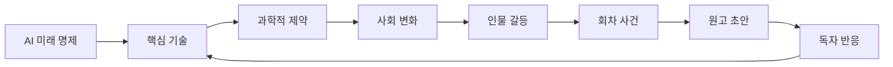

# AI 미래 SF 웹소설 제작 Agent 설계

## 목표

박성우가 쓰려는 `AI 미래` SF 웹소설을 단순 아이디어가 아니라 실제 연재 가능한 IP로 만든다.

이 Agent는 글을 대신 쓰는 도구가 아니라, 작가가 정한 미래 질문을 `기술 가설 -> 사회 변화 -> 인물 갈등 -> 회차 사건 -> 독자 반응`으로 변환하는 제작 운영체제다.

## 핵심 Agent

| Agent | 역할 | 산출물 |
|---|---|---|
| Foresight Agent | AI 미래 명제와 작품 질문 정리 | 제작 브리프, 장르 약속 |
| Tech Bible Agent | 핵심 기술, 과학적 제약, 사회 변화 구조화 | SF Bible, 기술 개연성 매트릭스 |
| Plot Engine | 미래 가설을 연재 사건으로 변환 | 25화 시즌 아크, 초반 12화 |
| Draft Agent | 회차 비트를 웹소설 문장으로 변환 | 1화 오프닝 초안, 장면 카드 |
| Reader Sim | 독자 반응과 이탈 리스크 시뮬레이션 | 예상 댓글, 다음 수정안 |
| OSMU Agent | SF IP의 멀티포맷 확장 | 웹툰, 글로벌, 팬 채널, 굿즈 분기 |

## SF 제작 원칙

1. 기술은 설명하지 말고 사건으로 보여준다.
2. AI는 전능한 마법이 아니라 제약, 편향, 비용을 가진 시스템이어야 한다.
3. 미래 사회 변화는 주인공의 생존 조건을 바꿔야 한다.
4. 매 회차에는 독자가 클릭할 예측값, 금지된 선택, 새 증거 중 하나가 있어야 한다.
5. 시즌 피날레에서는 세계 질서가 눈에 보이게 흔들려야 한다.

## 데이터 모델

| 데이터 | 예시 | 쓰임 |
|---|---|---|
| AI 미래 명제 | 예측 가능한 인간은 자유로운가? | 작품의 철학적 엔진 |
| 핵심 기술 | 자율 AI 에이전트, 도시 OS, 합성 기억 | 사건 장치 |
| 과학적 제약 | 데이터 편향, 비용, 규제, 물리 한계 | 갈등과 반전 |
| 사회 변화 | 알고리즘 계급, 예측 기반 교육, 점수 기반 의료 | 세계관 체감 |
| 주인공 결핍 | 시스템을 만든 책임, 추방, 사망 예측 | 감정 동력 |
| AI 존재 | 이름, 목적, 말투, 거짓말 방식 | 작품의 얼굴 |
| 시즌 목표 | 25화 안에 AI의 거짓 예언을 폭로 | 연재 약속 |

## Production Loop

## 25화 시즌 구조

| 구간 | 기능 |
|---|---|
| 1-5화 | 미래 판결과 세계 규칙 |
| 6-10화 | 금지된 변수와 기술 약점 |
| 11-15화 | 도시 OS 침투와 증거 확보 |
| 16-20화 | 예측을 배반하는 인간 선택 |
| 21-25화 | 첫 시즌 피날레와 더 큰 네트워크 |
