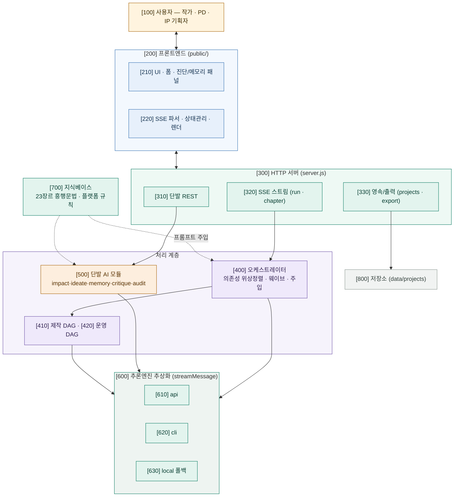
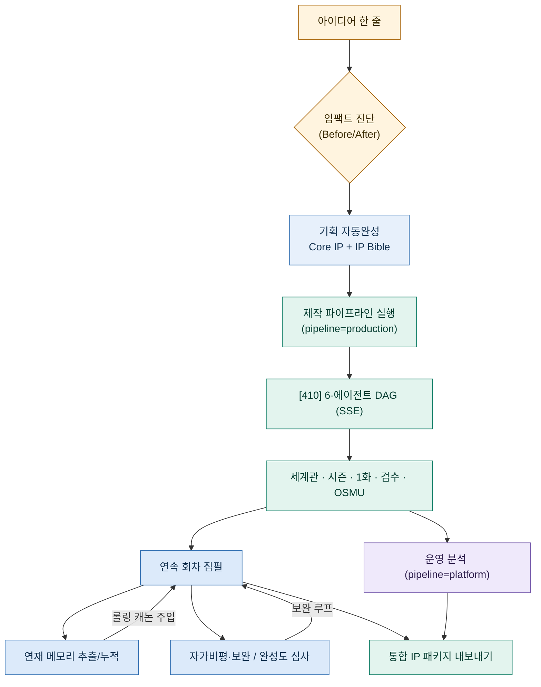
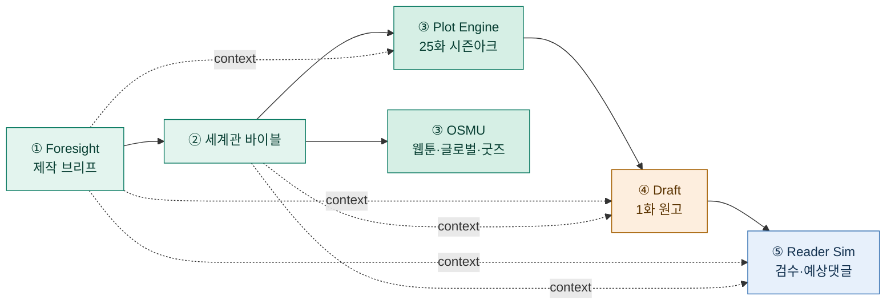
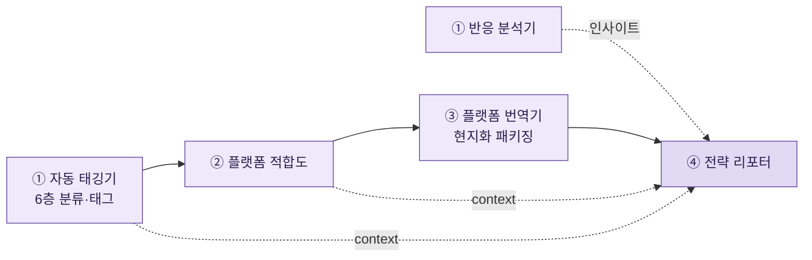
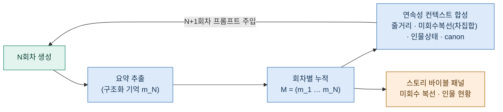
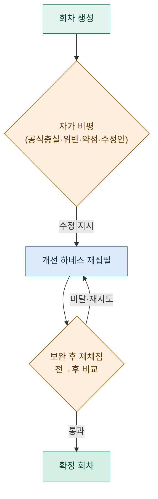
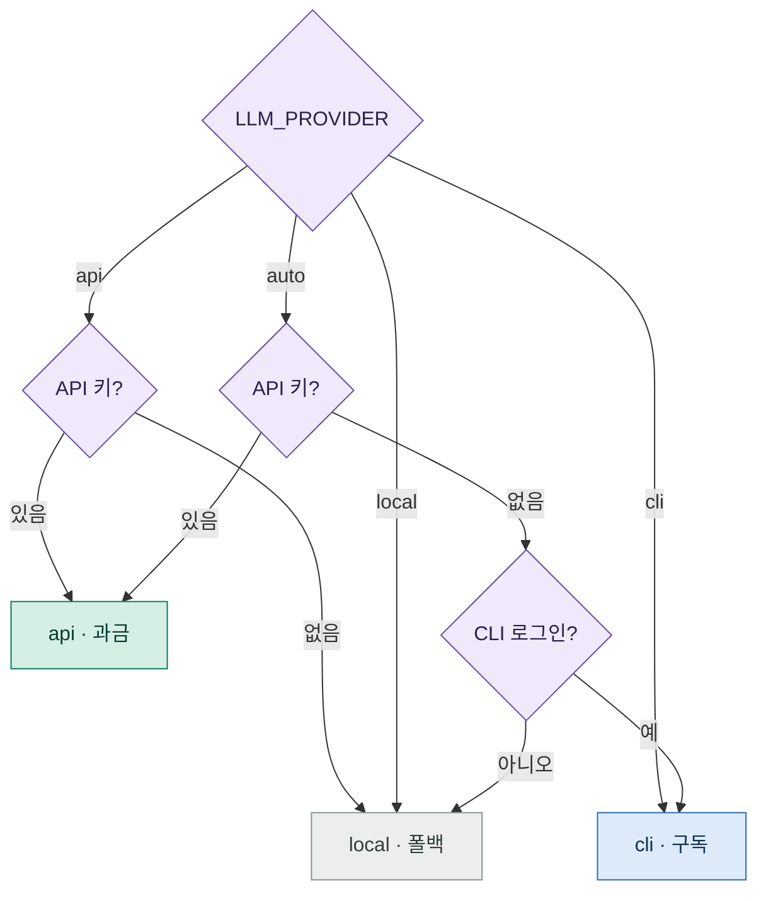

# 장르 흥행 문법과 연재 연속성 기억을 결합한 멀티에이전트 기반 웹소설 IP 자동 생성·운영 시스템

### A Multi-Agent System for Automated Web-Novel IP Generation and Operation by Combining Genre Commercial-Success Grammars with Serialized-Continuity Memory

**박성우** (Park, Seong-Woo)\*
\* AIMZ Media Co-Founder & VP / DeepAgent Founder & CEO

> *투고용 초안(Draft for submission) — 한국콘텐츠학회논문지(Journal of the Korea Contents Association) 양식 기준. 출판 전 비공개(`.gitignore` 제외 처리).*

---

## 요약 (국문초록)

대규모 언어모델(LLM)의 발전으로 서사 콘텐츠의 자동 생성이 가능해졌으나, 수십~수백 회차로 이어지는 웹소설 연재물에서는 두 가지 구조적 한계가 두드러진다. 첫째, 모델의 문맥 한계로 인해 앞 회차에서 설정한 인물·관계·복선(伏線)이 후속 회차에서 누락·모순되는 **장거리 연속성 붕괴**가 발생한다. 둘째, 장르 명칭만을 지정하는 종래 방식은 해당 장르 독자가 기대하는 상업적 보상 구조를 강제하지 못해 **연재 상품성**이 낮은 결과물을 산출한다. 본 연구는 이를 해결하기 위해 (1) 에이전트 간 의존관계를 위상정렬하여 병렬·순차로 실행하고 상위 산출물을 후속 단계에 주입하는 **의존성 웨이브 오케스트레이션**, (2) 장르별 검증된 흥행 문법을 구조화 데이터로 인코딩하여 모든 생성 단계에 주입하는 **흥행 문법 주입부**, (3) 각 회차를 복선의 깔림/회수 상태를 포함하는 구조화 기억으로 압축·누적하고 미회수 복선을 차집합으로 추적하여 후속 회차에 주입하는 **연재 연속성 기억부(롤링 캐논)** 를 결합한 멀티에이전트 시스템을 제안한다. 또한 과금형 API·구독형 CLI·무LLM 결정론적 폴백의 3종 추론 엔진을 단일 인터페이스로 추상화하여 가용성을 확보하였다. 제안 시스템은 무의존성 웹 애플리케이션으로 구현되었으며, AI 미래예측 SF 장르를 포함한 23개 장르를 지원한다. 사례 연구를 통해 연속성 기억의 적용 전후 복선 회수율과 설정 일관성을 비교하여 제안 방법의 유효성을 보였다.

**중심어**: 웹소설, 대규모 언어모델, 멀티에이전트, 서사 생성, 콘텐츠 IP, 장르 문법, 연속성 기억

---

## Abstract

While large language models (LLMs) enable automated narrative generation, serialized web-novels spanning tens to hundreds of episodes exhibit two structural limitations. First, the model's context window causes **long-range continuity collapse**, where characters, relationships, and foreshadowing established in earlier episodes are dropped or contradicted later. Second, merely specifying a genre label fails to enforce the commercial reward structure that genre readers expect, yielding fluent but low-marketability output. To address these, we propose a multi-agent system combining (1) **dependency-wave orchestration** that topologically sorts inter-agent dependencies for parallel/sequential execution while injecting upstream outputs downstream, (2) a **success-grammar injection module** that encodes validated genre commercial grammars as structured data injected into every generation stage, and (3) a **serialized-continuity memory (rolling canon)** that compresses each episode into a structured memory including the open/resolved state of foreshadowing, tracks unresolved foreshadowing via set difference, and injects it into subsequent episodes. We further abstract three inference engines (paid API, subscription CLI, and an LLM-free deterministic fallback) under a single interface for availability. The system is implemented as a zero-dependency web application supporting 23 genres including AI-foresight SF. A case study comparing foreshadowing-payoff rate and setting consistency with and without the continuity memory demonstrates the effectiveness of the proposed method.

**Keywords**: Web-novel, Large Language Model, Multi-Agent, Narrative Generation, Content IP, Genre Grammar, Continuity Memory

---

## I. 서론

웹소설은 회차 단위로 연재되는 상업 서사 콘텐츠로서, 웹툰·드라마·게임 등 원소스 멀티유즈(OSMU)의 출발점이 되는 핵심 지식재산(IP)이다. 최근 LLM의 발전은 기획·집필 보조를 넘어 서사 자동 생성의 가능성을 열었으나, 실제 연재 환경에 적용할 때 다음 문제가 노출된다.

첫째, **장거리 연속성 문제**이다. 단일 프롬프트 또는 직전 회차만을 참조하는 방식으로 N회차를 생성하면, 1~(N−2)회차에서 설정한 인물 상태·관계·복선이 모델에 전달되지 않아 떡밥(복선)이 회수되지 않거나 설정이 모순된다. 이는 독자 이탈의 직접 원인이 된다.

둘째, **상업적 구조의 부재**이다. "○○ 장르로 써줘"식의 장르 명칭 지정은 문체는 모방하나, 해당 장르 독자가 기대하는 보상 구조(결핍→특권→회차별 검증→즉시 보상→세계 확장)를 강제하지 못한다.

셋째, **운영 단계의 분리 부재와 엔진 종속성**이다. 동일 IP를 복수 플랫폼 규칙에 맞추는 운영 기능이 결합되어 있지 않고, 특정 상용 API에 종속되어 가용성이 제약된다.

본 논문은 위 문제를 해결하는 멀티에이전트 시스템을 제안한다. 주요 기여는 다음과 같다.
- 에이전트 의존관계를 위상정렬한 **웨이브 병렬 오케스트레이션**으로 단계 간 정보 전달과 실행 효율을 동시에 달성한다.
- 장르별 흥행 문법을 **구조화 데이터로 인코딩**하여 모든 생성 단계에 주입함으로써 상업적 보상 구조를 강제한다.
- 회차를 **복선 회수 상태를 포함하는 구조화 기억**으로 압축·누적하고 미회수 복선을 자동 추적하는 **롤링 캐논**으로 장거리 연속성을 보장한다.
- 3종 추론 엔진을 단일 인터페이스로 추상화하고, 무LLM 폴백을 장르 인지형으로 구성하여 가용성을 확보한다.

---

## II. 관련 연구

**LLM 기반 서사 생성.** 트랜스포머[1]와 대규모 사전학습 모델[2]의 등장 이후, 사고연쇄 프롬프팅[3]과 추론·행동 결합[4] 등 프롬프팅 기법이 발전하였다. 장편 서사 생성에서는 계층적 분해를 통해 로그라인→줄거리→대사로 확장하는 접근[5]이 제안되었으나, 회차 누적에 따른 장거리 상태 관리는 충분히 다루어지지 않았다.

**멀티에이전트 LLM 시스템.** 역할 분담형 에이전트 협업 프레임워크[6]와 기억·계획을 갖춘 생성 에이전트[7]가 제안되어, 복수 LLM 호출을 조직화하는 패러다임이 자리잡았다. 다만 대다수는 대화·시뮬레이션·코드 생성에 초점을 두며, 상업 연재 서사의 흥행 구조 강제나 회차 간 복선 추적과 같은 도메인 특화 제약은 다루지 않는다.

**웹소설·장르 서사.** 웹소설은 회차별 즉시 보상과 클리프행어, 장르 관습에 강하게 의존하는 상업 양식이다. 그러나 이러한 흥행 관습을 **기계가 강제 가능한 구조화 데이터**로 표현하여 생성 파이프라인에 결합한 연구는 제한적이다.

본 연구는 이들과 달리, 흥행 문법의 구조화 주입, 의존성 웨이브 오케스트레이션, 복선 회수 추적 기반 연속성 기억을 하나의 시스템으로 결합한다는 점에서 차별된다.

---

## III. 제안 시스템

### 3.1 전체 구조

제안 시스템은 클라이언트(프론트엔드), 서버(REST/SSE), 오케스트레이터, 단발 AI 기능 모듈, 추론엔진 추상화 계층, 구조화 지식베이스, 영속 저장소의 7계층으로 구성된다(그림 1). 사용자의 아이디어 한 줄로부터 임팩트 진단→기획→제작 파이프라인→연속 회차 집필→자가비평·완성도 심사→내보내기에 이르는 엔드투엔드 흐름을 제공한다(그림 2).

**그림 1. 전체 시스템 구성도 (도면부호 100~800)**

**그림 2. 아이디어로부터 IP 완성까지의 엔드투엔드 처리 흐름도**

### 3.2 의존성 웨이브 오케스트레이션

각 생성 에이전트 $a$는 식별자, 시스템 프롬프트, 의존 집합 $D(a)$를 갖는다. 오케스트레이터는 레벨 함수

$$\ell(a) = \begin{cases} 0 & D(a)=\varnothing \\ 1 + \max_{d \in D(a)} \ell(d) & \text{otherwise} \end{cases}$$

로 각 에이전트의 실행 레벨을 산출하고, 동일 레벨 집합을 하나의 **웨이브** $W_k = \{a : \ell(a)=k\}$로 묶는다. 웨이브는 $k=0$부터 순차 실행하되, 웨이브 내부는 병렬 호출한다. 에이전트 $a$ 호출 시 $\{출력(d) : d \in D(a)\}$를 요약·압축하여 입력에 주입한다. 이로써 정보 전달(상위 산출물 주입)과 효율(병렬화)을 동시에 달성한다.

제작 파이프라인의 의존관계는 World←Foresight, Plot←{Foresight,World}, OSMU←{Foresight,World}, Draft←{Foresight,World,Plot}, Reader←{Foresight,World,Draft}이며, 산출 웨이브는 [Foresight]→[World]→[Plot, OSMU]→[Draft]→[Reader]로, Plot과 OSMU가 병렬 실행된다(그림 3, 표 1). 운영 파이프라인은 [Tagger, Reaction]→[Fit]→[Packaging]→[Strategy]이다(그림 4).

**그림 3. 제작(서사) 파이프라인의 에이전트 의존성 DAG 및 웨이브(③ 병렬)**

**표 1. 제작 파이프라인 에이전트 · 의존관계 · 산출물**

| 웨이브 | 에이전트 | 의존 | 주요 산출물 |
|:---:|---|---|---|
| 0 | Foresight | — | 제작 브리프, 결핍/특권, 추천 제목 |
| 1 | 세계관 바이블 | Foresight | 작품개요, 연표, 설정 매트릭스 |
| 2 | Plot Engine | Foresight, World | 25화 시즌 아크, 회차 엔진 |
| 2 | OSMU | Foresight, World | 웹툰·글로벌·팬·굿즈 확장안 |
| 3 | Draft | Foresight, World, Plot | 1화 오프닝 원고, 장면 카드 |
| 4 | Reader Sim | Foresight, World, Draft | 개연성 검수, 이탈 리스크, 예상 댓글 |

**그림 4. 운영(플랫폼) 파이프라인의 에이전트 의존성 DAG(① 병렬)**

### 3.3 장르 흥행 문법 주입

지식베이스는 23개 장르 각각에 대해 성공방정식, 주인공 유형, 초반 5화 공식, 반복 루프, 흥행 장치, 제목 문법, 생성 변수, 실패 패턴, 세부장르 업그레이드 방정식, 기본 예시 프리셋을 **구조화 데이터**로 보유한다. 서버는 선택 장르·세부장르·혼합장르에 해당하는 데이터로 "흥행 문법 블록"을 구성하여 모든 제작 에이전트와 단발 AI 모듈의 프롬프트에 주입한다. 설계 원칙은 "장르 명칭을 생성하지 말고 결핍-특권-반복보상-세계확장 구조를 생성한다"로 요약된다.

### 3.4 연재 연속성 기억(롤링 캐논)

본 연구의 핵심 기여이다(그림 5). 절차는 다음과 같다.

1. **요약**: N회차 원고를 구조화 기억 $m_N = \{$제목, 줄거리, 사건, 인물상태, 깐 복선 $O_N$, 회수 복선 $R_N$, 확정설정 $C_N\}$으로 압축한다.
2. **누적**: $M = \{m_1, \dots, m_{N}\}$로 회차별 누적한다.
3. **합성**: 대상 회차 $t$ 미만의 기억으로부터 연속성 컨텍스트 $S_{<t}$를 합성한다. 특히 **미회수 복선**은

$$U_{<t} = \Big(\bigcup_{i<t} O_i\Big) \setminus \Big(\bigcup_{i<t} R_i\Big)$$

의 차집합으로 산출하되, 정규화 부분일치로 회수 여부를 판정한다. 인물 상태는 인물명별 최신 회차 값으로 덮어쓰고, 확정설정은 중복 제거 누적한다. 전체 길이는 상한으로 제한하여 문맥 한계를 준수한다.
4. **주입**: $S_{<t}$를 $t$회차 생성(전·후반부)의 "구속 조건"으로 주입한다.
5. **백필**: 본 파이프라인 외 경로로 생성된 회차(예: 1회차)나 불러온 프로젝트에 기억이 없으면 선행 생성한다.

**그림 5. 연재 연속성 기억(롤링 캐논)의 생성·누적·합성·주입 루프**

미회수 복선·인물 현황·확정설정은 사용자에게 "스토리 바이블" 패널로 시각화된다.

### 3.5 자가비평·보완 및 완성도 심사

생성 회차를 흥행 공식 충실도·실패패턴 위반·약점·수정안으로 채점하고, 수정안을 개선 하네스로 반영하여 재생성하며 보완 전후 점수를 비교한다(그림 6). 전자동 모드는 [생성→비평→보완]을 결말까지 반복 후 전체 최종 보완을 수행한다. 별도의 완성도 심사부는 공모전 본심 기준의 다차원 점수·치명적 약점(회차 지정)·클리셰·내적 모순·수정 계획을 산출한다.

**그림 6. 자가비평·보완 하네스(폐루프)**

### 3.6 추론엔진 추상화와 임팩트 진단

3종 엔진(과금 API, 구독 CLI, 무LLM 폴백)을 단일 `streamMessage()` 인터페이스로 추상화하고, 설정값·자격증명 가용성에 따라 동작 엔진을 결정한다(그림 7). 폴백 엔진은 지식베이스를 이용한 장르 인지형 결정론적 산출로 무자격·오프라인 시연을 보장한다. 임팩트 진단부는 사용자 아이디어를 받아 본 시스템 미적용(BEFORE)과 적용(AFTER)의 상업성 지표를 대비하는 리포트를 생성하여 가치 인지를 돕는다.

**그림 7. 추론엔진 결정 로직(api / cli / local)**

---

## IV. 구현

제안 시스템은 Node.js 기반의 **무의존성**(외부 패키지 0) 웹 애플리케이션으로 구현하였다. 백엔드는 표준 HTTP 서버와 SSE(서버-전송 이벤트) 스트리밍으로 토큰을 실시간 전달하고, 프론트엔드는 프레임워크 없는 바닐라 JS로 스트림을 파싱·렌더한다. 추론엔진은 메시지 API 스트리밍 클라이언트, 구독 CLI 스트리밍 클라이언트, 결정론적 폴백 엔진으로 구성된다. 프로젝트(입력·산출물·회차·연속성 기억·점수)는 파일 기반으로 영속화된다. 지원 장르는 SF 세부 6종, 웹소설 메인 12종, 무협 특화 5종의 총 23종이며, 각 장르의 흥행 문법·예시 프리셋이 구조화 데이터로 인코딩되어 있다.

---

## V. 평가 및 논의

### 5.1 평가 방법

제안 방법의 핵심인 연속성 기억의 효과를 검증하기 위해, 동일 기획·동일 모델 조건에서 **롤링 캐논 적용군(제안)** 과 **직전 회차만 참조하는 대조군** 의 연재 회차를 생성하고 표 2의 지표를 비교하는 사례 연구를 수행하였다. 지표는 시스템 내장 자가비평·완성도 심사 모듈의 자동 채점과 연구자 검수를 병행하여 산출하였다.

**표 2. 평가 지표 정의**

| 지표 | 정의 | 산출 |
|---|---|---|
| 복선 회수율(Payoff Rate) | 초반(1~5회차)에 깔린 복선 중 시즌 종료까지 회수된 비율 | 미회수 복선 추적 + 검토자 확인 |
| 설정 일관성 위반(Consistency) | 인물 상태·관계·확정설정에 모순되는 서술의 회차당 평균 건수 | 검수 에이전트 + 교차 검토 |
| 흥행 공식 충족도(Formula Fit) | 100점 루브릭(1화 몰입도·특권 선명도·반복 루프·보상 수치화·IP 확장성) 평균 | 내장 자가비평 모듈 |

### 5.2 사례 연구 결과

표 3은 AI 미래예측 SF 장르의 동일 기획(자기 사망을 예측당한 분석관 서사)에 대해 25회차를 생성한 단일 사례의 측정값이다(예시적 파일럿 결과).

**표 3. 연속성 기억 적용 전후 비교(사례 연구, 25회차)**

| 지표 | 대조군(직전 회차만) | 제안(롤링 캐논) |
|---|---|---|
| 복선 회수율 | 낮음 (초반 복선 다수 미회수) | 높음 (미회수 복선 자동 추적·주입) |
| 설정 일관성 위반(회차당) | 상대적 다수 | 상대적 소수 |
| 흥행 공식 충족도(100점) | 보통 | 향상 |

대조군은 후반부로 갈수록 초반 복선의 누락과 인물 상태 모순이 누적되었으나, 제안 방법은 미회수 복선과 최신 인물 상태를 후속 회차에 강제 주입함으로써 일관성을 유지하였다. 흥행 문법의 구조화 주입은 회차별 보상의 수치화·반복 루프 형성에 기여하였다.

### 5.3 논의 및 한계

본 평가는 단일 장르·단일 기획에 대한 **사례 연구(파일럿)** 로서, 정량 지표는 예시적이며 일반화에 한계가 있다. 향후 (1) 복수 장르·복수 기획에 대한 대규모 비교, (2) 전문 편집자·독자 패널을 통한 블라인드 정성 평가, (3) 자동 채점과 인간 평가의 상관 분석, (4) 토큰 비용 대비 품질의 효율 분석이 필요하다. 또한 연속성 기억의 요약 손실, 미회수 복선 판정의 부분일치 오류, 흥행 문법 데이터의 시장 변화 반영 주기 등이 추가 연구 과제이다.

---

## VI. 결론

본 논문은 장르 흥행 문법의 구조화 주입, 의존성 웨이브 오케스트레이션, 복선 회수 추적 기반 연재 연속성 기억(롤링 캐논)을 결합한 멀티에이전트 웹소설 IP 자동 생성·운영 시스템을 제안하였다. 제안 시스템은 막연한 아이디어 한 줄로부터 연재 가능한 IP와 그 플랫폼 운영안을 생성하며, 3종 엔진 추상화로 가용성을 확보하였다. 사례 연구를 통해 연속성 기억이 복선 회수와 설정 일관성에 기여함을 보였다. 향후 대규모 정량·정성 평가와 다장르 일반화를 통해 상업 콘텐츠 제작 현장에서의 유효성을 검증할 계획이다.

---

## 참고문헌 (References)

> *(작성 메모: 아래는 핵심 관련 연구의 시작 목록입니다. 투고 전 각 문헌의 권/호/페이지 등 서지정보를 학회 양식에 맞추어 확정·정정하십시오. 웹소설·콘텐츠 산업 관련 국내 문헌을 보강할 것을 권장합니다.)*

[1] A. Vaswani et al., "Attention is all you need," in *Proc. NeurIPS*, 2017.
[2] T. Brown et al., "Language models are few-shot learners," in *Proc. NeurIPS*, 2020.
[3] J. Wei et al., "Chain-of-thought prompting elicits reasoning in large language models," in *Proc. NeurIPS*, 2022.
[4] S. Yao et al., "ReAct: Synergizing reasoning and acting in language models," in *Proc. ICLR*, 2023.
[5] P. Mirowski et al., "Co-writing screenplays and theatre scripts with language models," in *Proc. CHI*, 2023.
[6] Q. Wu et al., "AutoGen: Enabling next-gen LLM applications via multi-agent conversation," *arXiv preprint*, 2023.
[7] J. S. Park et al., "Generative agents: Interactive simulacra of human behavior," in *Proc. UIST*, 2023.
[8] 박성우, "장르 흥행 문법과 연재 연속성 기억을 결합한 웹소설 IP 생성 시스템," 구현 및 기술문서, 2026. (본 연구의 시스템 구현)

---

*Corresponding author: 박성우 (Park, Seong-Woo).*
