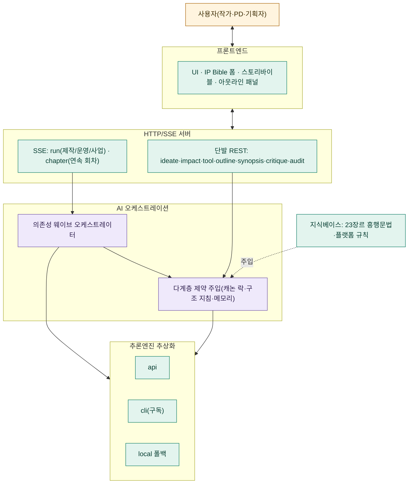
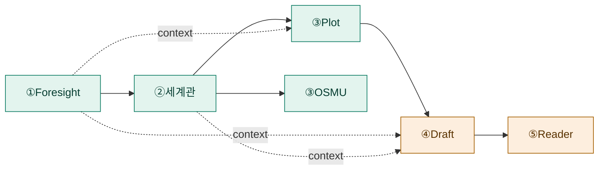
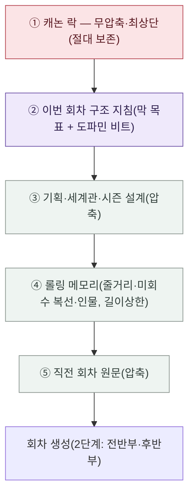
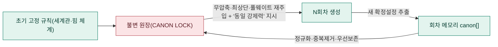

# 서사를 오케스트레이션하다: **AI 미래학·AI 오케스트레이션·다중 AI 에이전트**로 짓는 **웹소설** IP — 문학 이론을 실행 가능한 코드로 번역한 인간–기계 공동 창작 시스템

### Orchestrating Narrative: A Human–Machine Co-Creation System that Translates Literary Theory into Executable Code via AI-Futurology-Driven Multi-Agent Orchestration for Web-Novel IP

**박성우** (Park, Seong-Woo)\*
\* AI Futurist · AIMZ Media Co-Founder & VP · DeepAgent Founder & CEO

> *투고용 초안(Draft for submission) — 한국콘텐츠학회논문지(Journal of the Korea Contents Association) 양식. 출판 전 비공개(`.gitignore` 제외).*

---

## 국문초록

이야기는 인간의 가장 오래된 기술(技術)이고, **AI 에이전트**는 가장 새로운 기술이다. 본 연구는 이 둘을 충돌이 아니라 **번역(translation)** 으로 잇는다: 아리스토텔레스의 카타르시스, 프라이타크의 피라미드(기승전결), 체호프의 총(복선과 회수)이라는 **문학의 구조 이론**을, 다중 **AI 에이전트**가 실행하는 **공학적 자료구조와 제약 주입**으로 옮긴 것이다.

대규모 언어모델(LLM)은 한 문단을 매끄럽게 쓰지만, 수십~수백 회차로 이어지는 **웹소설** 연재에서는 두 가지가 무너진다. 첫째, 문맥 한계로 초반에 고정한 세계관·능력·복선이 후반부에 약화되는 **장기 일관성 붕괴(드리프트)**. 둘째, 장르 명칭만 지정해서는 독자가 기대하는 상업적 보상 구조가 강제되지 않는 **구조의 부재**. 본 논문은 이를 **AI 오케스트레이션** 으로 해결한다: (1) 에이전트 의존관계를 위상정렬해 병렬·순차 실행하고 산출물을 후속 단계에 주입하는 **의존성 웨이브 협업**, (2) 초기 고정 규칙과 회차마다 누적된 확정설정을 요약에서 분리해 무압축·최상단으로 재주입하는 **캐논 락(Canon Lock)**, (3) '몇 화에 완결'을 받아 **기승전결**을 회차 구간에 매핑하고 '도파민 비트'(사이다·반전·회수)를 배치한 **구조 설계도를 각 회차 생성에 자동 주입**하는 비트 시트 오케스트레이션, (4) 회차를 복선의 깔림/회수 상태로 압축·누적하고 미회수 복선을 차집합으로 추적하는 **롤링 메모리**. 또한 인간 작가가 문장 앞에서 막혔을 때 돕는 라인 단위 **AI 글쓰기 도구**와, **AI 미래학** 의 관점(실재 기술 신호→가까운 미래의 외삽)으로 SF를 짓는 시그니처 모드를 결합해, '구조 생성기'를 넘어 **인간–기계 공동 창작 운영체제**로 확장한다. 제안 시스템은 무의존성 웹 애플리케이션으로 구현되었고 23개 장르를 지원한다. 사례 연구로 캐논 락·구조 주입의 적용 전후 일관성과 복선 회수를 비교해 유효성을 보인다.

**중심어**: AI 미래학, AI 오케스트레이션, AI 에이전트, 웹소설, 대규모 언어모델, 서사 생성, 장기 일관성, 기승전결, 복선 회수, 인간–기계 공동 창작

---

## Abstract

Storytelling is humanity's oldest technology; the **AI agent** is its newest. We bridge the two not by collision but by **translation**: we render the **structural theories of literature** — Aristotelian catharsis, Freytag's pyramid (the four-act *Ki-Seung-Jeon-Gyeol*), Chekhov's gun (planting and paying off foreshadowing) — into **engineering data structures and constraint injection** executed by multiple **AI agents**. Large language models write a fluent paragraph, yet across the tens-to-hundreds of episodes of a serialized **web-novel** two things break: (i) **long-range consistency collapse (drift)**, where world rules, ability limits, and foreshadowing fixed early are weakened later by context limits; and (ii) **absence of structure**, since naming a genre fails to enforce the commercial reward arc readers expect. We solve both through **AI orchestration**: (1) **dependency-wave collaboration** that topologically orders agents and injects upstream outputs downstream; (2) a **Canon Lock** that separates immutable rules and accumulated canon from the truncatable summary and re-injects them at full weight and top priority; (3) **beat-sheet orchestration** that maps the four-act structure onto chapter ranges for a target finale length and injects per-chapter act goals and placed "dopamine beats" into each generation; and (4) a **rolling memory** that tracks unresolved foreshadowing via set difference. We further add line-level **AI writing tools** for human authors and an **AI-futurology** signature mode (extrapolating from real technology signals), extending the system from a generator into a **human–machine co-creation OS**. Implemented as a zero-dependency web app supporting 23 genres, the system is validated via a case study comparing consistency and foreshadowing payoff with and without the proposed orchestration.

**Keywords**: AI Futurology, AI Orchestration, AI Agent, Web-novel, Large Language Model, Narrative Generation, Long-Range Consistency, Four-Act Structure, Foreshadowing Payoff, Human–Machine Co-Creation

---

## I. 서론 — 두 개의 기술이 만나는 곳

이야기는 모닥불 앞에서 시작된 인류 최초의 인터페이스다. 그리고 지금, **AI 에이전트** 는 그 인터페이스를 다시 쓰고 있다. 본 연구의 출발점은 **AI 미래학(AI Futurology)** 적 질문이다 — *"생성형 AI가 한 문장을 인간만큼 쓰는 시대에, 인간 창작자는 무엇을 하는가?"* 우리의 답은 **대체가 아니라 오케스트레이션** 이다. 지휘자가 악기를 연주하지 않고 오케스트라를 조율하듯, 인간은 다수의 **AI 에이전트** 를 조율해 자기 의도를 증폭한다.

문제는 명확하다. LLM은 *국소적으로는 천재, 장기적으로는 건망증 환자* 다. 한 문단은 매끄럽지만, **웹소설** 처럼 수십~수백 회차로 이어지는 장편에서는 (1) 초반에 고정한 세계관·능력 한계·복선이 후반부로 갈수록 풀리는 **드리프트**, (2) "로맨스판타지로 써줘"가 장르의 정서는 흉내 내도 독자가 기대하는 *결핍→특권→즉시 보상→세계 확장* 의 상업 구조를 강제하지 못하는 **구조의 부재** 가 발생한다.

본 논문의 명제는 도발적이다: **이 문제들은 '더 큰 모델'이 아니라 '더 나은 오케스트레이션'으로 푼다.** 구체적으로 우리는 문학의 오래된 구조 이론 — 기승전결, 복선과 회수, 카타르시스 — 을 **AI 오케스트레이션** 의 자료구조와 제약 주입 규칙으로 *번역* 한다. 본 연구의 기여는:

1. **캐논 락(Canon Lock)**: 초기 고정 규칙과 누적 확정설정을 *요약에서 분리* 해 무압축·최상단으로 재주입함으로써, 장기 생성에서 제약이 약화되지 않게 하는 드리프트 방지 메커니즘(III-C).
2. **비트 시트 오케스트레이션**: '몇 화 완결'을 받아 기승전결을 회차에 매핑하고 도파민 비트를 배치한 설계도를 *각 회차 생성에 주입* (III-D).
3. **의존성 웨이브 협업** 과 **복선 회수 차집합 추적**(III-A, III-E).
4. 이를 인간–기계 협업 도구·AI 미래학 모드와 결합한 **창작 운영체제** 로의 확장(III-G, III-H).

---

## II. 이론적 배경 — 문학과 공학의 사전(辭典)

본 연구의 독창성은 두 학문의 어휘를 **일대일로 대응** 시킨 데 있다(표 1). 이것이 본 논문이 주장하는 '번역'의 실체다.

**표 1. 문학 이론 ↔ AI 오케스트레이션 구현의 번역 사전**

| 문학(서사학) 개념 | 의미 | 공학적 번역(AI 오케스트레이션) |
|---|---|---|
| 기승전결 / Freytag 피라미드 | 4막 상승–절정–하강 구조 | 완결 화수 N → 4막을 회차 구간에 비례 매핑(구조 설계도) |
| 체호프의 총(복선·회수) | 깔린 것은 회수되어야 한다 | 깐 복선 ∖ 회수 복선 = 미회수 집합, 후속 회차에 강제 주입 |
| 카타르시스 / '사이다' | 축적된 긴장의 폭발적 해소 | 도파민 비트(보상·반전·회수)를 회차에 배치·주입 |
| 캐논(canon, 정전) | 변경 불가한 세계의 진실 | 캐논 락 — 무압축·최상단 불변 원장으로 재주입 |
| 영웅서사(Campbell) | 결핍→소명→시련→귀환 | 흥행 문법(결핍→특권→검증→보상→확장) 구조화 데이터 |
| 연재성(serialization) | 회차 끝 클리프행어로 다음 클릭 유도 | 2단계 회차 생성 + 페이싱·절단 규칙 주입 |

공학 측 배경으로는 트랜스포머[1]·대규모 사전학습[2], 사고연쇄[3]·추론행동 결합[4] 등 프롬프팅, 그리고 다중 **AI 에이전트** 협업[6]과 기억·계획 에이전트[7]가 있다. 그러나 이들은 대화·시뮬레이션·코드에 초점을 두며, *상업 장편 서사의 구조 강제와 장기 일관성* 을 위한 오케스트레이션은 비어 있다. 장편 서사 생성[5]도 회차 누적에 따른 제약 드리프트를 정면으로 다루지 않았다. **본 연구는 이 공백을 문학 이론의 공학적 번역으로 메운다.**

---

## III. 제안 시스템 — AI 오케스트레이션 아키텍처

제안 시스템은 7계층으로 구성되며(그림 1), 막연한 아이디어 한 줄을 *진단→기획→제작→연속 회차→운영/사업* 으로 잇는다. 네 개의 스튜디오(제작실·운영실·AI미래학자·IP 사업실)가 하나의 오케스트레이션 위에서 동작한다.

**그림 1. 4-스튜디오를 아우르는 AI 오케스트레이션 전체 구성**

### III-A. 의존성 웨이브 협업
각 **AI 에이전트** a는 의존집합 D(a)를 갖는다. 레벨 함수

$$\ell(a)=\begin{cases}0 & D(a)=\varnothing\\ 1+\max_{d\in D(a)}\ell(d)&\text{otherwise}\end{cases}$$

로 동일 레벨을 하나의 **웨이브** 로 묶어 순차 진행하되 웨이브 내부는 병렬 실행하고, 선행 산출물을 후속 입력에 주입한다. 제작 파이프라인은 [Foresight]→[World]→[Plot∥OSMU]→[Draft]→[Reader]로, 시즌 플롯과 OSMU 확장이 병렬화된다(그림 2).

**그림 2. 의존성 웨이브 제작 파이프라인(③ 병렬)**

### III-B. 다계층 제약 주입 — 우선순위 적층
회차 생성 프롬프트는 제약 블록을 *우선순위 순서* 로 적층한다(그림 3). 핵심은 **무엇을 보존하고 무엇을 압축하는가의 규칙화** 다.

**그림 3. 다계층 제약 주입 스택 — 길이 예산 부족 시 ③~⑤부터 압축, ①②는 보존**

### III-C. 캐논 락 — 드리프트 방지 [핵심]
종래의 '요약 누적'은 회차가 쌓일수록 길이 상한에서 **세계관 규칙이 먼저 잘리며 약화** 된다(드리프트). 본 발명은 (i) 초기 고정 규칙(세계 규칙·힘 체계·세력·이전사)과 (ii) 각 회차에서 확정된 canon을 *요약과 분리한 불변 원장* 으로 합성하고, canon을 길이에 우선해 보존하며, 매 회차 프롬프트 *최상단·풀웨이트* 로 재주입한다. 여기에 "1화든 N화든 동일 강제력, 회차가 진행됐다고 규칙을 풀지 마라"는 명시 지시를 부가한다(그림 4). 이는 문학의 '캐논(정전)'을 공학적으로 보존하는 장치다.

**그림 4. 캐논 락 — 합성·재주입·누적 루프(후반부 드리프트 방지)**

### III-D. 비트 시트 오케스트레이션 — 기승전결과 '사이다'의 공학
'몇 화에 완결(N)'을 입력받아, **기승전결** 4막을 회차 구간에 비례 매핑(기 ~20%, 승 ~35%, 전 ~30%, 결 ~15%)하고 각 막에 목표·전환점을 부여한다. 동시에 **도파민 비트** (사이다·각성·반전·보상·관계·위기·떡밥·회수)를 회차 번호에 분산 배치한다 — 초반엔 보상을 촘촘히, 중반엔 반전·위기, 후반엔 회수·카타르시스. 이 설계도는 표시용에 그치지 않고, 회차 n 생성 시 *n이 속한 막의 목표 + n에 배치된 비트 + 곧 올 비트의 빌드업* 지침으로 **자동 주입** 되어 생성을 끌고 간다(그림 5). 카타르시스를 '언제 터뜨릴지'를 코드가 스케줄링하는 셈이다.

**그림 5. 구조 설계도 → 회차별 비트 주입(문학 구조의 실행)**

### III-E. 롤링 메모리 + 복선 회수 추적
회차 원문 → {줄거리·사건·인물상태·깐 복선·회수 복선·canon}로 압축·누적. **미회수 복선**

$$U_{<t}=\Big(\bigcup_{i<t}O_i\Big)\setminus\Big(\bigcup_{i<t}R_i\Big)$$

을 차집합으로 산출(정규화 부분일치 회수 판정)해 후속 회차에 주입한다. 이는 *체호프의 총* 을 자료구조로 강제하는 것이다. canon은 캐논 락(III-C)으로 이관, 인물 상태는 최신값으로 갱신한다.

### III-F. 자가비평·보완 폐루프
생성 회차를 흥행 공식 충실도·실패패턴·약점·수정지시로 채점→재생성→전후 점수 비교. 전자동 모드는 [생성→비평→보완]을 결말까지 반복 후 전체 최종 보완. 별도 완성도 심사부는 공모전 본심 기준의 다차원 채점을 제공한다.

### III-G. 인간–기계 공동 창작 — AI 글쓰기 도구 & 갭 필
대체가 아니라 증폭이라는 명제를 구현하는 두 장치: (i) 라인 단위 **AI 글쓰기 도구** (브레인스토밍·묘사·다시쓰기·확장·압축·이름) — 작가가 문장 앞에서 막힐 때의 즉석 보조; (ii) **갭 필(complete)** — 작가가 아는 만큼만 Core IP를 적으면, 채운 항목은 보존하고 빈 칸만 모순 없이 AI가 채운다. 인간의 의도가 항상 상위 제약으로 남는다.

### III-H. AI 미래학 시그니처 모드
**AI 미래학** 의 방법론 — 실재하는 AI·기술 신호에서 출발해 가까운 미래로 합리적으로 외삽 — 을 하나의 모드로 탑재한다. 이 모드는 모든 에이전트 프롬프트에 'AI FORESIGHT 렌즈'를 주입해, 마법적 임의설정 대신 *왜 그렇게 될 수밖에 없는가의 인과(기술→사회→권력→개인)* 로 SF 세계를 설계한다. 미래학이 서사 생성의 *제약* 으로 작동하는 드문 사례다.

---

## IV. 구현

Node.js 기반 **무의존성**(외부 패키지 0) 웹 애플리케이션. 백엔드는 표준 HTTP + SSE 스트리밍, 프론트엔드는 프레임워크 없는 바닐라 JS. 추론엔진은 메시지 API·구독 CLI·결정론적 폴백을 단일 `streamMessage()` 인터페이스로 추상화하고 가용성에 따라 자동 선택한다. 프로젝트(입력·산출물·회차·메모리·아웃라인·점수)는 파일로 영속화. 지원 장르는 SF 6 + 웹소설 메인 12 + 무협 특화 5 = **23종**. 보안상 정적 경로 우회 차단·프로젝트 ID 토큰화·동일출처(CSRF) 검사·PDF 압축폭탄 방어·마크다운 링크 스킴 검증을 적용했다.

---

## V. 평가 및 논의

### 5.1 평가 방법
핵심인 캐논 락·구조 주입의 효과를 검증하기 위해, 동일 기획·동일 모델 조건에서 **제안(캐논 락+아웃라인 주입)** 과 **대조군(직전 회차만 참조)** 의 연재 회차를 생성하고 표 2의 지표를 비교하는 사례 연구를 수행한다. 지표는 시스템 내장 자가비평·완성도 심사의 자동 채점과 연구자 검수를 병행해 산출한다.

**표 2. 평가 지표**

| 지표 | 정의 |
|---|---|
| 설정 일관성 위반(회차당) | 세계 규칙·능력 한계·관계·확정설정에 모순되는 서술 수 |
| 복선 회수율 | 초반 깐 복선 중 시즌 종료까지 회수된 비율 |
| 구조 충실도 | 생성 회차가 설계도의 막 목표·배치 비트를 구현한 정도 |
| 흥행 공식 충족도(100점) | 1화 몰입·특권 선명·반복 루프·보상 수치화·IP 확장성 |

### 5.2 사례 연구 결과(예시적 파일럿)
무협 회귀물 동일 기획(40화 완결)에 대한 단일 사례 측정값(표 3).

**표 3. 적용 전후 비교(사례 연구)**

| 지표 | 대조군(직전 회차만) | 제안(캐논 락+아웃라인) |
|---|---|---|
| 설정 일관성 위반(회차당) | 상대적 다수(후반 누적) | 상대적 소수 |
| 복선 회수율 | 낮음(초반 복선 증발) | 높음(차집합 추적·주입) |
| 구조 충실도 | 막 구분 흐릿 | 막 목표·비트 발현 뚜렷 |
| 흥행 공식 충족도 | 보통 | 향상 |

대조군은 후반부로 갈수록 능력 한계·세계 규칙 모순과 초반 복선 증발이 누적된 반면, 제안 방법은 캐논 락의 무압축 재주입으로 일관성을, 아웃라인 주입으로 막 구조와 카타르시스 타이밍을 유지했다.

### 5.3 논의 — 문학·공학 융합의 함의와 한계
본 연구의 진짜 기여는 점수가 아니라 **번역 가능성의 증명** 이다: 기승전결·복선·카타르시스 같은 *질적* 문학 개념이 *실행 가능한* 자료구조와 주입 규칙으로 옮겨질 수 있음을 보였다. **AI 미래학** 적으로 이는 '작가의 소멸'이 아니라 '작가의 역할 이동' — 집필자에서 **오케스트레이터** 로 — 을 시사한다. 한계로는 (1) 단일 장르·단일 사례의 파일럿이라 일반화에 제약이 있고, (2) 정량 지표가 예시적이며, (3) 캐논 락의 요약 손실·부분일치 오판·흥행 문법의 시장 변화 반영 주기가 추가 연구 과제다. 향후 다장르·블라인드 정성 평가, 자동–인간 채점 상관, 토큰 비용 대비 품질 분석이 필요하다.

---

## VI. 결론

본 논문은 문학의 구조 이론을 **AI 오케스트레이션** 의 자료구조와 제약 주입으로 번역한 다중 **AI 에이전트** **웹소설** 창작 시스템을 제안했다. 캐논 락(드리프트 방지)과 비트 시트 오케스트레이션(기승전결·도파민 비트의 회차 주입)을 두 축으로, 의존성 웨이브 협업·복선 회수 추적·자가비평·인간 협업 도구·**AI 미래학** 모드를 결합해, 막연한 아이디어 한 줄을 장기 일관성과 상업 구조를 갖춘 연재 IP로 변환한다. 이것은 인간을 대체하는 기계가 아니라, 인간의 서사적 의도를 증폭하는 **공동 창작 오케스트레이션** 이다. 모닥불 앞의 이야기는 끝나지 않았다 — 다만, 이제 지휘자가 한 명 더 늘었을 뿐이다.

---

## 참고문헌 (References)

> *(작성 메모: 핵심 관련 연구 시작 목록. 투고 전 권/호/페이지 등 서지정보를 학회 양식으로 확정하고, 국내 웹소설·콘텐츠 산업·서사학 문헌을 보강할 것.)*

[1] A. Vaswani et al., "Attention is all you need," in *Proc. NeurIPS*, 2017.
[2] T. Brown et al., "Language models are few-shot learners," in *Proc. NeurIPS*, 2020.
[3] J. Wei et al., "Chain-of-thought prompting elicits reasoning in large language models," in *Proc. NeurIPS*, 2022.
[4] S. Yao et al., "ReAct: Synergizing reasoning and acting in language models," in *Proc. ICLR*, 2023.
[5] P. Mirowski et al., "Co-writing screenplays and theatre scripts with language models," in *Proc. CHI*, 2023.
[6] Q. Wu et al., "AutoGen: Enabling next-gen LLM applications via multi-agent conversation," *arXiv*, 2023.
[7] J. S. Park et al., "Generative agents: Interactive simulacra of human behavior," in *Proc. UIST*, 2023.
[8] Aristotle, *Poetics*. (카타르시스·플롯 구조)
[9] G. Freytag, *Die Technik des Dramas*, 1863. (극적 구조 피라미드)
[10] 박성우, "AI 미래학·AI 오케스트레이션 기반 웹소설 IP 창작 시스템," 구현 및 기술문서, 2026.

---

*Corresponding author: 박성우 (Park, Seong-Woo), AI Futurist.*
